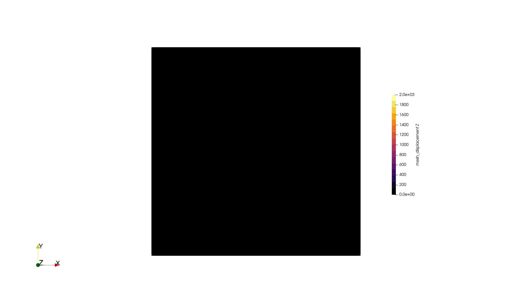

---
date:
  created: 2026-02-20
authors:
  - danieldouglas92
---

# A working example

(contributed by Daniel Douglas)

## Introduction

Following the [previous article](2026-01-uv.md), which outlined how to setup a python virtual environment using `uv` and then compile ASPECT with LandLab, we will now outline how to run a more geologically interesting example demonstrating the successful interfacing between the two software packages. The model will be a 3D Cartesian box that gets uniformly uplifted over the model time, with topography that gets eroded based on stream power and hillslope diffusion. A crucial piece of information which must be passed between ASPECT and LandLab is the velocity. For each time step, the ASPECT model will solve the Stokes equations to determine the velocity within the ASPECT model domain. ASPECT will then send the velocities at the model surface, which is the interface between LandLab and ASPECT, to LandLab where it will be used to uplift and laterally advect the surface while calculating changes in the topography due to erosion/deposition. This change in topography will then be passed back to ASPECT as a velocity which is used to advect the surface of ASPECT to match the surface of LandLab, and the process continues. 

<!-- more -->

## 1. The ASPECT file

In this simple example, the velocity that ASPECT interally computes will be a straightforward, uniform upward velocity of 1 cm/yr. This can be easily achieved in ASPECT by setting the velocity boundary conditions using a function, which looks like this:

```
subsection Boundary velocity model
  set Prescribed velocity boundary indicators = left: function, right: function, front: function, back: function, bottom: function
  subsection Function
    set Coordinate system   = cartesian
    set Variable names      = x, y, z
    set Function constants  = uplift=0.01
    set Function expression = 0; 0; uplift
  end
end
```

This specifies that the lateral (left, right, front, back) and bottom boundary conditions all move vertically upward, which means that the entire volume moves vertically upward. The surface of the ASPECT model is set to deform according to LandLab by setting the top boundary to be a mesh deforming boundary:

```
subsection Mesh deformation
  set Mesh deformation boundary indicators = top: Landlab
  set Additional tangential mesh velocity boundary indicators = left, right, front, back

  subsection Landlab
    set MPI ranks for Landlab = 1
    set Script name           = vertical_advection
    set Script argument       =
    set Script path           =

    set Hillslope diffusion coefficient       = 1e-4
    set Stream power erodibility coefficient  = 1e-5
    set Define LandLab parameters using years = true

    subsection Mesh information
      set X extent = 102e3
      set Y extent = 102e3
      set Spacing  = 500
    end
  end
end
```

Within this code block the extent of the LandLab mesh is also specified, as well some parameters controlling the rate of erosion (`Hillslope diffusion coefficient` and `Stream power erodibility coefficient`). The name of the python file containing other information is called `vertical_advection.py`, which we discuss below.

## 2. The LandLab file

LandLab contains many components which dictate how a landscape should evolve, and processes can be added by importing new components. Here, we only consider hillslope diffusion, which smooths topography due to gravity, and stream power erosion, which carves topography based on the routing of water through the landscape. In order to use these components, they are first imported in `vertical_advection.py` 

```
from landlab.components import LinearDiffuser
from landlab.components import FlowAccumulator
from landlab.components import StreamPowerEroder
```
FlowAccumulator routes water based on the topography, which then causes erosion through StreamPowerEroder, and LinearDiffuser determines hillsope diffusion. The routing of water will strongly influence the evolution of topography, and the direction of water flow can be controlled by the boundary conditions on the LandLab mesh. Here, we set the North and East boundary conditions of the LandLab model to be closed, preventing the routing of water out of these boundaries. Below we show the creation of the LandLab model grid, using the parameters specified in the ASPECT file, as well as setting the boundary conditions of the LandLab mesh.

```
x_extent = dict_grid_information["Mesh X extent"]
y_extent = dict_grid_information["Mesh Y extent"]
spacing = dict_grid_information["Mesh Spacing"]

nrows = int(y_extent / spacing)  # number of node rows
ncols = int(x_extent / spacing)  # number of node columns

model_grid = landlab.RasterModelGrid((nrows, ncols), xy_spacing=(spacing, spacing))
model_grid.set_closed_boundaries_at_grid_edges(True, True, False, False)
```

Within a given ASPECT time step, landscape evolution occurs in the following way:

```
aspect_dt = end_time - current_time

deposition_erosion = np.zeros(model_grid.number_of_nodes)

x_velocity = dict_variable_name_to_value_in_nodes["x velocity"]
y_velocity = dict_variable_name_to_value_in_nodes["y velocity"]
z_velocity = dict_variable_name_to_value_in_nodes["z velocity"]

# Substepping for surface processes
if aspect_dt>0:
    n_substeps = 10
    dt = aspect_dt / n_substeps
    for _ in range(n_substeps):

      elevation_before = elevation.copy()

      # Run the landlab components: First route the water, use stream power to erode based on
      # the routing of the water, then diffuse the topography
      flow_accumulator.run_one_step()
      stream_power_eroder.run_one_step(dt)
      linear_diffuser.run_one_step(dt)

      # Uplift the topography using the ASPECT vertical velocity.
      elevation[model_grid.core_nodes] += z_velocity[model_grid.core_nodes] * dt

      deposition_erosion += elevation - elevation_before
```
the ASPECT timestep is subdivided into 10 smaller timesteps, and the ASPECT velocity (x_velocity, y_velocity, z_velocity) is used to uplift the LandLab surface after running each of the three LandLab components. The change in topography is stored in the parameter `deposition_erosion`, which is used to determine how the ASPECT velocity should move after LandLab has finished running. 

## 3. The output
Below is high resolution output from the `vertical_advection.prm` example. It is showing the vertical displacement of the ASPECT mesh over the span of 1 Myr. The boundary conditions of the LandLab mesh prevent water from flowing out of the North and East boundaries, which is why the topography is low in the Southwest corner, and high in the Northeast corner. 
{ width=1000px }
