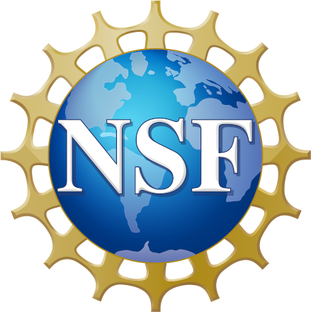

#

## Welcome

{ width="100", align=left }
This is the project website for the NSF sponsored project "Collaborative Research: Frameworks: Coupling bulk and surface processes in simulating the solid earth with ASPECT and LandLab". For more information please see the [About section](about.md).

The main goal of this project is to parallelize the surface evolution code [Landlab](https://landlab.csdms.io/) and couple it with the mantle convection code [ASPECT](https://aspect.geodynamics.org/).

